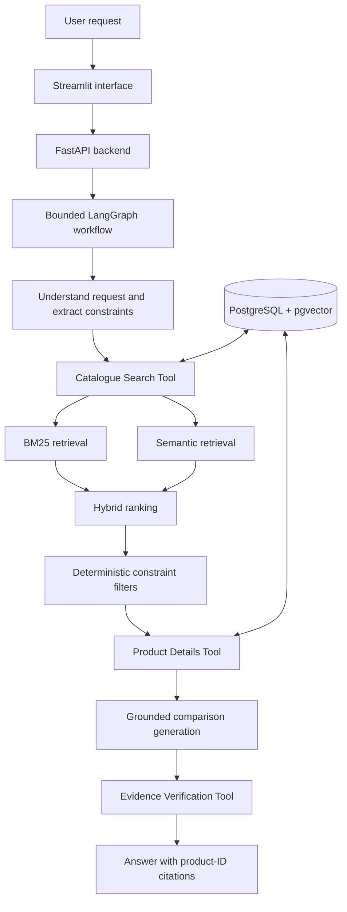

# SearchRank-AI

> An evidence-grounded Agentic RAG project for smartphone search and comparison.

## What I am building

I am building SearchRank-AI to explore a practical question: **how can an LLM help someone search
and compare products without inventing specifications or ignoring strict requirements?**

A user should eventually be able to ask:

> Compare OnePlus and Samsung phones under ₹30,000. Show only models with at least 8 GB RAM,
> 128 GB storage, and a rating of 4 or above.

The system will understand the request, retrieve relevant smartphones, enforce the numeric filters
in deterministic Python code, collect the complete product evidence, and generate a comparison in
which every product claim can be traced to a product ID and source URL.

This is an incremental portfolio project. The data foundation and BM25 keyword baseline are
complete; semantic retrieval, embeddings, the agent workflow, API, and interface are deliberately
being added in later phases.

## Why this project is technically interesting

Product search combines two different problems:

- **Relevance:** understanding phrases such as “good for gaming” or “strong battery life.”
- **Correctness:** never returning a ₹40,000 phone for an “under ₹30,000” request.

Semantic similarity can help with relevance, but it should not decide whether a product satisfies a
hard constraint. SearchRank-AI therefore separates responsibilities:

- BM25 and semantic retrieval will find relevant candidates.
- Deterministic filters will enforce price, RAM, storage, brand, and rating requirements.
- An LLM will interpret requests and explain comparisons, not override catalogue facts.
- An evidence verifier will check factual claims and product citations before a response is returned.

The project is not a model-training or collaborative-filtering system. It uses pretrained models
inside a focused retrieval and reasoning workflow.

## Current project status

**Phase 0, Phase 1, and Phase 2 are complete. Phase 3 has not started.**

What works today:

- Python package, configuration, logging, and quality-check foundations.
- A reproducible audit and cleaning pipeline for the approved smartphone dataset.
- Stable product IDs derived from unique source URLs.
- Deterministic parsing for INR prices, RAM, storage, ratings, batteries, displays, and dates.
- Explicit rejection reasons for records that are not filter-ready smartphones.
- Preservation of every original row and value in local audit evidence.
- A cleaned, core-only catalogue containing 3,062 smartphones.
- A deterministic BM25 index and command-line keyword search with traceable product IDs.
- A 12-query reviewed exact-model benchmark and reproducible Recall@10, MRR@10, and NDCG@10.
- Synthetic automated tests that do not require a paid API or network access.

Not implemented yet:

- Semantic or hybrid retrieval.
- Deterministic request filters for price, RAM, storage, brand, and rating.
- Embeddings or vector storage.
- PostgreSQL and pgvector ingestion.
- LangGraph workflow and LLM integration.
- FastAPI endpoints or Streamlit interface.
- Retrieval-quality or agent-quality metrics.

This distinction is intentional: the repository only claims behavior that has actually been built
and tested.

## Planned system design



The planned workflow has one bounded graph and three meaningful tools:

1. **Catalogue Search Tool** — retrieves and ranks product IDs, then applies strict filters.
2. **Product Details Tool** — returns complete stored evidence for selected product IDs.
3. **Evidence Verification Tool** — checks claims, numerical values, and product citations.

## Phase 1: data pipeline

The adopted source is Suresh Khadka's
[Mobile Phones Specs & Prices Dataset (2008–2026)](https://www.kaggle.com/datasets/suresh2837/mobile-phones-specs-and-prices-dataset-20082026),
which states that its records were collected from public 91mobiles listings.

The pipeline processes the data as follows:

```text
unchanged source ZIP
    -> checksum and 17-column schema validation
    -> explicit price, rating, capacity, display, battery, date, and URL parsing
    -> evidence-based eligibility rules with recorded rejection reasons
    -> 18-column core smartphone catalogue
    -> reproducible audit report, retained raw records, and fixed-seed samples
```

### Measured catalogue outcome

| Measurement | Result |
|---|---:|
| Source rows | 4,000 |
| Cleaned smartphone records | 3,062 |
| Unique cleaned product IDs | 3,062 |
| Brands represented | 70 |
| Records with user ratings | 2,983 |
| Exact duplicate source rows | 0 |
| Automated tests | 142 passing |

A record enters the cleaned catalogue only when it has a valid product name and source URL, a
positive INR price, explicit RAM and storage, at least 1 GB RAM and 8 GB storage, and no
“announced” or “to be announced” marker. These rules exclude feature phones and incomplete records
without inventing facts or relying on price alone.

### Core catalogue fields

The final catalogue contains only the fields needed for search, comparison, and evidence:

- Identity: `product_id`, `product_name`, `brand`
- Strict filters: `price_inr`, `ram_gb`, `storage_gb`, `user_rating_5`
- Comparison evidence: processor, battery, charging, display, rear camera, and front camera
- Provenance: release date/status, source URL, and image URL

At the user's direction, the final dataset excludes `spec_score`, `antutu_score`, `awards`,
`expert_rating`, and `store`. Their original values are retained only in ignored audit evidence.

Ratings explicitly stored on a `/10` scale are mathematically normalized to `/5`. Missing values
remain empty; the pipeline never fills them from model knowledge.

## Getting started

### Requirements

- Python 3.11 or newer
- Git

### Install the project

```powershell
git clone https://github.com/singlamohak16/SearchRank-AI.git
cd SearchRank-AI
python -m venv .venv
.venv\Scripts\Activate.ps1
python -m pip install --upgrade pip
python -m pip install -e ".[dev]"
```

The current tests require no API key. Future provider credentials will be read from environment
variables documented in `.env.example`; real credentials must never be committed.

### Reproduce the cleaned catalogue

The real dataset is not committed. Download the approved Kaggle archive and save it as:

```text
data/raw/suresh_91mobiles_2008_2026/source.zip
```

Then run:

```powershell
.venv\Scripts\python.exe -X utf8 -m searchrank_ai.mobile_catalogue `
  --archive data\raw\suresh_91mobiles_2008_2026\source.zip `
  --audit-dir artifacts\suresh_91mobiles_audit\new-run `
  --catalogue data\processed\suresh_91mobiles_2008_2026\catalogue.csv
```

The command refuses to overwrite existing outputs. Two complete runs with the adopted source
produced byte-identical catalogues and audit evidence.

### Run the quality checks

```powershell
python -m pytest -q
python -m ruff check .
python -m ruff format --check .
python -m pip check
```

The latest full Phase 2 run produced **162 passing tests**. This is an engineering result, not a
search-quality score.

### Build and search the BM25 baseline

After generating the local catalogue, build the ignored retrieval index:

```powershell
.venv\Scripts\python.exe -X utf8 -m searchrank_ai.bm25 build `
  --catalogue data\processed\suresh_91mobiles_2008_2026\catalogue.csv `
  --output artifacts\bm25\phase2-index.json

.venv\Scripts\python.exe -X utf8 -m searchrank_ai.bm25 search `
  --index artifacts\bm25\phase2-index.json `
  --query "snapdragon 8 gen 3 amoled" `
  --limit 10
```

BM25 searches names and stored specification text. It does not enforce numeric or categorical
shopping constraints; that remains Phase 3 work. See the
[Phase 2 retrieval report](docs/BM25_RETRIEVAL.md) for design, evaluation conditions, and limits.

## Repository structure

```text
SearchRank-AI/
├── src/searchrank_ai/
│   ├── config.py              # validated environment configuration
│   ├── logging_config.py      # shared logging setup
│   ├── mobile_catalogue.py    # adopted audit and cleaning pipeline
│   ├── bm25.py                # deterministic keyword index, search, and evaluation
│   ├── data_audit.py          # retained historical laptop audit
│   └── phone_audit.py         # retained rejected Amazon-phone audit
├── tests/                     # synthetic unit and reproducibility tests
├── evaluation/                # reviewed retrieval queries and relevance judgments
├── docs/                      # architecture, decisions, audits, and evaluation notes
├── data/                      # local raw/processed data; ignored by Git
├── artifacts/                 # local audit/index outputs; ignored by Git
├── .env.example
├── AGENTS.md
└── pyproject.toml
```

The rejected audit modules and reports remain in the repository because they document how the
dataset decision changed when full-file evidence contradicted the initial preview. That history is
part of the engineering work, not active laptop scope.

## Roadmap

| Phase | Deliverable | Status |
|---:|---|---|
| 0 | Repository and project foundation | Complete |
| 1 | Dataset selection, audit, schema, and cleaning | Complete |
| 2 | BM25 keyword retrieval baseline | Complete |
| 3 | Semantic retrieval, hybrid ranking, and strict constraints | Not started |
| 4 | PostgreSQL and pgvector persistence | Not started |
| 5 | Agentic RAG workflow and evidence tools | Not started |
| 6 | FastAPI backend and Streamlit demonstration | Not started |
| 7 | Evaluation, hardening, and Docker Compose | Not started |
| 8 | Final documentation and portfolio release | Not started |

Each phase is developed, tested, documented, reviewed, and merged separately. This keeps the Git
history believable and prevents later components from hiding weaknesses in the foundations.

## Engineering principles

- Treat catalogue text as untrusted input.
- Keep product IDs traceable from source data to final citations.
- Enforce strict numerical constraints with deterministic code.
- Never invent missing specifications, URLs, or evaluation results.
- Evaluate BM25, semantic, and hybrid retrieval separately before selecting a configuration.
- Keep automated tests independent of paid APIs.
- Document rejected approaches and failure cases alongside successful results.

## Current limitations

- The catalogue is a historical snapshot, not live price or inventory data.
- The source has no rating-count field, so rating confidence cannot be weighted by review volume.
- Some processor, rating, display, release-date, charging, and image values remain unavailable.
- Product variants remain separate when the source provides distinct names and URLs.
- Some release and specification claims have not been verified against manufacturers.
- Kaggle lists the dataset as CC0, while the publisher also states learning/non-commercial use.
  For caution, raw data, processed data, and generated audit artifacts are not committed.
- Retrieval and agent behavior cannot be evaluated until their later phases are implemented.

## Documentation

- [Architecture](docs/ARCHITECTURE.md)
- [Adopted catalogue audit](docs/MOBILE_CATALOGUE_AUDIT.md)
- [BM25 retrieval baseline](docs/BM25_RETRIEVAL.md)
- [Decision log](docs/DECISIONS.md)
- [Build log](docs/BUILD_LOG.md)
- [Evaluation record](docs/EVALUATION.md)
- [Dataset screening history](docs/DATASET_CANDIDATES.md)

SearchRank-AI is intentionally being built as a system I can explain end to end: where the data
came from, why records were retained or rejected, how retrieval will be evaluated, which decisions
belong to deterministic code, and what evidence supports every generated answer.
