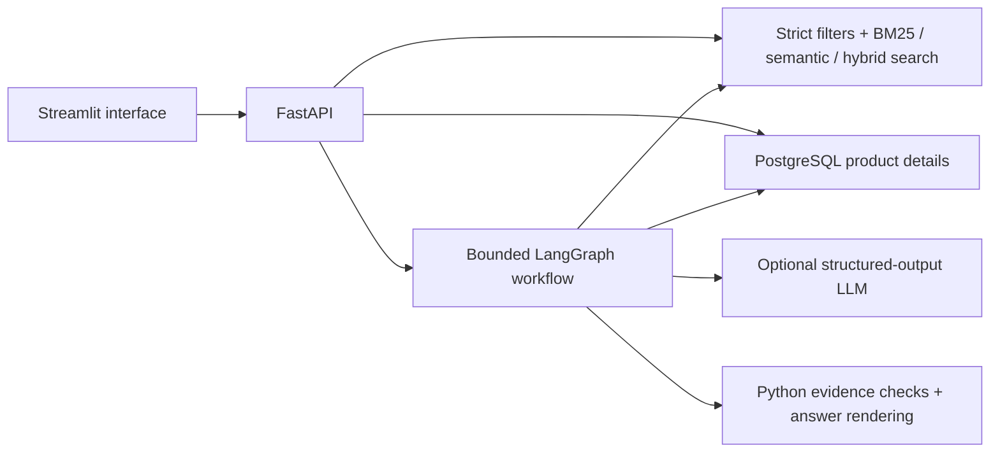

# SearchRank-AI

An evidence-grounded smartphone search and comparison project built with Python, hybrid retrieval,
LangGraph, FastAPI, PostgreSQL/pgvector, and Streamlit.

I built SearchRank-AI to explore a practical question: **can an AI shopping assistant explain its
recommendations without making up phone specifications?** The project combines keyword and
embedding search, applies strict catalogue filters in Python, and checks AI-generated facts and
comparisons against retrieved product records before displaying them.

This is a portfolio demonstration using a **historical catalogue**, not an online shop. Prices,
ratings, and availability are not live, and a higher search score does not mean a better phone.

## What you can do

- **Discover:** search 3,062 catalogue phones using BM25, semantic, or hybrid ranking. Apply brand,
  price, RAM, storage, and rating constraints; inspect the component scores.
- **Compare phones:** shortlist up to three phones and compare their stored specifications.
  Missing values remain visibly unavailable.
- **Ask AI:** with a separately configured provider, submit natural-language requests and inspect
  the workflow, citations, and verification outcome. Unsupported or unverifiable claims are withheld.

Ordinary search and side-by-side comparison need no LLM key. The default `mock` provider is for
automated tests; it deliberately does **not** enable interactive AI answers.

## How it works

```mermaid
flowchart LR
    UI[Streamlit interface] --> API[FastAPI]
    API --> Search[Strict filters + BM25 / semantic / hybrid search]
    API --> Products[PostgreSQL product details]
    API --> Agent[Bounded LangGraph workflow]
    Agent --> Search
    Agent --> Products
    Agent --> LLM[Optional structured-output LLM]
    Agent --> Verify[Python evidence checks + answer rendering]
```

Hybrid ranking combines normalized BM25 and cosine scores. The selected BM25 weight is 0.25.
The API searches local BM25 and NumPy embedding indexes; PostgreSQL provides product evidence.
There is also a tested pgvector cosine-search path, but it is **not** the API's hybrid ranking engine.
See the [architecture guide](docs/ARCHITECTURE.md) for the boundaries and trade-offs.

## Run it locally

Follow the [setup and troubleshooting guide](docs/SETUP.md) from a fresh clone. It covers:

1. Installing Python dependencies and obtaining the source dataset separately.
2. Auditing the data and building the two search indexes.
3. Starting PostgreSQL, ingesting the catalogue, and starting the API/UI with Docker Compose.
4. Checking readiness and, optionally, configuring Gemini after confirming your own free-tier status.

Once running, open [the website](http://127.0.0.1:8501/) or
[interactive API documentation](http://127.0.0.1:8000/docs).
The [five-minute demo](docs/DEMO.md) includes requests, a recorded response, and an AI-free fallback.
Do not put real credentials in repository files or share resolved Docker environment output.

## Measured results

Rerun on **2026-09-18**, using the same 3,062-product snapshot and 20 reviewed retrieval queries:

| Search mode | Recall@10 | MRR@10 | NDCG@10 |
|---|---:|---:|---:|
| BM25 | 0.8111 | 0.8125 | 0.8090 |
| Semantic | 0.9375 | 0.8875 | 0.8998 |
| Hybrid, BM25 weight 0.25 | 0.9250 | 0.9500 | 0.9286 |

Hybrid gave the best top-rank metrics among the tested configurations; semantic search had the
highest recall. The same small set selected the weight and measured it—there is no held-out test set.

All **16 scripted workflow scenarios** passed again. These exercise the real graph, tools, and
verifier using supplied mock-model decisions and four synthetic products. They do not measure
real-LLM accuracy. Historical live Gemini checks are smoke tests, not a model-quality benchmark.
The [results report](docs/RESULTS.md) includes all weights, denominators, reproduction commands,
timing conditions, and limitations.

## Data and limitations

The adopted source is Suresh Khadka's
[Mobile Phones Specs & Prices Dataset (2008–2026)](https://www.kaggle.com/datasets/suresh2837/mobile-phones-specs-and-prices-dataset-20082026),
described by its publisher as originating from 91mobiles. The audited 2026-09-04 snapshot contains
4,000 rows; deterministic cleaning retains 3,062 records and 18 core fields. IDs are derived from
the original source URL slugs, and those URLs remain attached to the records.

The publisher's CC0 label and learning/non-commercial usage note conflict. Raw data, cleaned data,
embeddings, and generated reports are therefore **not redistributed in this repository**. See the
[adoption audit](docs/MOBILE_CATALOGUE_AUDIT.md) for checksums and the exact cleaning rules.
Earlier rejected laptop and phone audits are retained as decision history, not active data sources.

This project does not independently certify scraped facts, infer missing specifications, process
payments, or fetch current retailer inventory. Free-provider quotas and data-use conditions apply.
The local app has no production authentication, load-testing claim, or comprehensive accessibility
certification. Live retailer integration is deferred until after Phase 8 and requires a new scope decision.

## Project guide

| Read this | For |
|---|---|
| [Setup](docs/SETUP.md) | Installation, configuration, tests, and troubleshooting |
| [Architecture](docs/ARCHITECTURE.md) | Runtime flow, data flow, and trust boundaries |
| [Results](docs/RESULTS.md) | Measured retrieval/workflow results and reproduction |
| [Demo](docs/DEMO.md) | A short walkthrough and API examples |
| [Gemini setup](docs/GEMINI_SETUP.md) | Optional provider, privacy, and quota boundaries |
| [API and UI](docs/API_AND_UI.md) / [UI design](docs/UI_REDESIGN.md) | Contracts and interaction details |
| [Interview notes](docs/INTERVIEW.md) | Honest résumé bullets and technical questions |
| [Release preparation](docs/RELEASE.md) | Draft notes and unpublished release checklist |
| [Decisions](docs/DECISIONS.md) / [Build log](docs/BUILD_LOG.md) | Incremental engineering history |

Application code is under `src/searchrank_ai/`, automated checks under `tests/`, and reviewed
evaluation cases under `evaluation/`. Historical phase reports remain under `docs/`.

Phases 0–7, Gemini integration, and the UI redesign are merged. Phase 8 prepares the final project
documentation and release handoff; it does not itself publish a tag or release. The package remains
`0.1.0.dev0` until a separately approved release/version change. No repository-wide code license has
been selected; the dataset's label is not a license for this code.
